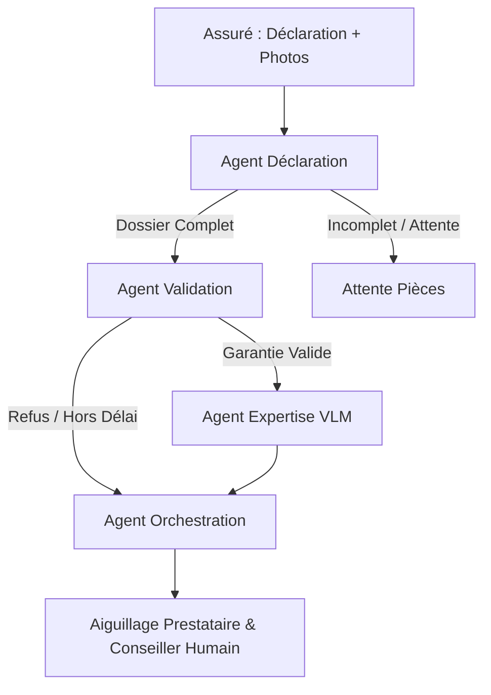

# 🏢 AssurHabitat - Système Multi-Agents d'Instruction de Sinistres IA

[](https://www.python.org/)
[](https://python.langchain.com/docs/langgraph)
[]()
[](https://fastapi.tiangolo.com/)
[](https://github.com/features/actions)

Système multi-agents autonome pour la qualification, la validation contractuelle, l'expertise visuelle et l'orientation automatisée des déclarations de sinistres habitation. 

La solution est conçue pour exécuter des modèles **100% Open-Weights** (`Mistral-7B` pour le texte et `LLaVA` pour la vision multimodal via Ollama) sur infrastructure souveraine privée, garantissant la confidentialité stricte des données de santé/logement des assurés et le respect complet du RGPD sans recours à des API tierces publiques.

---

## 🎯 Périmètre Métier

Le système traite de manière asynchrone trois grandes familles de sinistres habitation :
* 💧 **Dégâts des eaux :** Fuites, infiltrations, ruptures de canalisation, débordements.
* 🔥 **Incendie / Explosion :** Incendies domestiques, explosions, dommages causés par la fumée.
* 🚪 **Vol / Cambriolage :** Effractions, dégradations, vols de biens meubles.

---

## 🏗️ Architecture Multi-Agents (LangGraph)

L'orchestration repose sur un graphe d'états déterministe (`SinistreState`) développé avec **LangGraph** qui pilote quatre nœuds d'agents spécialisés :




### Rôle des Agents :

* **Agent IA Déclaration (Mistral 7B) :** Extrait de manière structurée les entités Pydantic (date, description, type de sinistre, présence de photos) et contrôle la complétude du dossier.
* **Agent IA Validation (Mistral 7B) :** Évalue la conformité au contrat d'assurance (délais légaux de 2 jours ouvrés pour vol et 5 jours pour eau/feu, présence obligatoire du dépôt de plainte).
* **Agent IA Expertise (LLaVA Multimodal) :** Analyse les photos jointes au sinistre pour qualifier la sévérité visuelle des dégâts et préparer le rapport d'expertise.
* **Agent IA Orchestration :** Aiguille automatiquement le dossier vers le bon prestataire agréé (*Plombier partenaire*, *Serrurier / Vitrier*, *Expert sécurité incendie*, ou *Conseiller généraliste*).

---

## 📊 Évaluation & Benchmark Certifié (Golden Dataset)

Le système a été évalué en condition réelle d'inférence GPU (Mistral 7B + LLaVA) sur le **Golden Dataset** de référence (9 scénarios de tests représentatifs) :

| Agent / Étape | Métrique Évaluée | Score Obtenu | Statut |
| --- | --- | --- | --- |
| **Déclaration** | `Completude_Declaration_Score` (Extraction Pydantic) | **100 % (1.00)** | ✅ Validé |
| **Validation** | `Conformite_Contrat_Score` (Respect des clauses/délais) | **100 % (1.00)** | ✅ Validé |
| **Orchestration** | `Precision_Prestataire_Score` (Routing prestataire exact) | **100 % (1.00)** | ✅ Validé |
| **Expertise** | Analyse de vision multimodale | *Revue manuelle expert* | 🔍 Qualitatif |

---

## 🛠️ Stack Technique

* **Orchestration Agentique :** LangGraph, LangChain, Pydantic v2
* **Modèles Open-Weights :** `Mistral-7B-Instruct` (LLM Texte), `LLaVA` (VLM Multimodal) via **Ollama**
* **API & Service :** FastAPI, Uvicorn (Inférence asynchrone)
* **Déploiement & Containerisation :** Docker, Docker Compose
* **Gestionnaire de dépendances :** Poetry (Python 3.11)
* **Intégration Continue :** GitHub Actions (CI/CD)

---

## 🚀 Installation, Test Local & API

### Prérequis

* Python 3.11
* [Poetry](https://python-poetry.org/)
* [Ollama](https://ollama.com/) (avec les modèles `mistral` et `llava` installés)

### 1. Installation & Lancement des Modèles

```bash
# Cloner le dépôt
git clone [https://github.com/Abdata92/AssuranceHabitat_Agents_IA.git](https://github.com/Abdata92/AssuranceHabitat_Agents_IA.git)
cd AssuranceHabitat_Agents_IA

# Installer les dépendances
poetry install

# Télécharger les modèles open-weights
ollama pull mistral
ollama pull llava

```

### 2. Exécution du Benchmark GPU

```bash
poetry run python src/run_gpu_inference.py

```

### 3. Lancement de l'API REST de Production

```bash
# Lancement de l'API FastAPI en arrière-plan
poetry run uvicorn src.api:app --host 0.0.0.0 --port 8000 &

# Tester la santé de l'API
curl http://localhost:8000/health

# Soumettre un sinistre de test
curl -X POST http://localhost:8000/api/v1/sinistres/process \
  -H "Content-Type: application/json" \
  -d '{
    "declaration_id": "REQ-001",
    "raw_declaration": "Infiltration d eau au plafond du salon suite a une fuite chez le voisin.",
    "image_paths": []
  }'

```

---

## 🐳 Déploiement Docker & CI/CD

Le projet inclut un fichier `Dockerfile` et un `docker-compose.yml` pour un déploiement containerisé sur serveur GPU, ainsi qu'un workflow GitHub Actions dans `.github/workflows/ci-cd.yml` pour :

1. Valider la syntaxe et exécuter les tests d'évaluation sur le code.
2. Builder et publier l'image Docker sur le registre GitHub (GHCR).
3. Déployer automatiquement la mise à jour sur le serveur GPU de production.

```bash
# Déploiement rapide via Docker Compose
docker compose up -d --build

```

---

## 📂 Structure du Projet

```text
├── .github/workflows/
│   └── ci-cd.yml                  # Pipeline CI/CD GitHub Actions
├── data/
│   ├── golden_dataset.csv          # Jeu de données de référence (9 cas de test)
│   └── evaluation_results.csv      # Résultats certifiés du Benchmark (100%)
├── src/
│   ├── agents/
│   │   ├── declaration_agent.py   # Agent de saisie et structuration Pydantic
│   │   ├── validation_agent.py    # Agent de contrôle des règles contrat
│   │   ├── expertise_agent.py     # Agent d'analyse visuelle multimodal
│   │   └── orchestration.py       # Graph LangGraph et routage des prestataires
│   ├── api.py                     # API REST FastAPI de production
│   ├── state.py                   # Définition du dictionnaire d'état Pydantic
│   ├── evaluate.py                # Moteur de calcul des métriques d'évaluation
│   └── run_gpu_inference.py       # Exécution GPU du benchmark complet
├── Dockerfile                     # Image Docker de l'API Multi-Agents
├── docker-compose.yml             # Orchestration Docker (API + Ollama)
├── pyproject.toml                 # Configuration Poetry
└── README.md                       # Documentation technique du système

```

---

## 👤 Auteur & Contact

**Abel FOUOBE** – *Senior Data Scientist / ML Engineer*

* **LinkedIn :** [linkedin.com/in/abel-fouobe-55486181](https://www.linkedin.com/in/abel-fouobe-55486181)
* **GitHub :** [@Abdata92](https://github.com/Abdata92)

```

```
