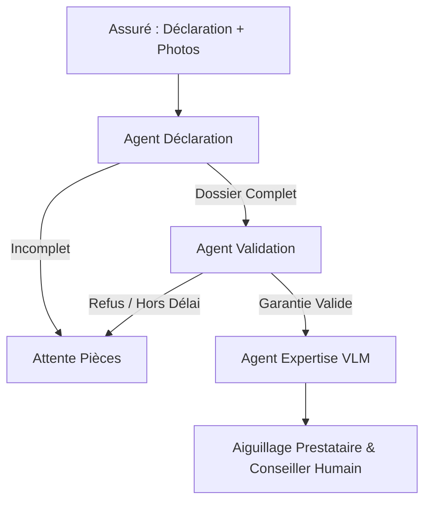

# 🏢 AssurHabitat - Système Multi-Agents d'Instruction de Sinistres IA

[](https://www.python.org/)
[](https://python.langchain.com/docs/langgraph)
[]()

Système multi-agents autonome pour la qualification, la validation contractuelle et l'expertise technique des déclarations de sinistres habitation. La solution est conçue pour exécuter des modèles **100% Open-Weights** (Mistral, Qwen-VL) sur infrastructure privée, garantissant la confidentialité stricte des données de santé/logement et le respect du RGPD.

---

## 🎯 Périmètre & Périmètre Métier

Le système traite de manière asynchrone trois grandes familles de sinistres habitation :
* 💧 **Dégâts des eaux :** Fuites, infiltrations, ruptures de canalisation.
* 🔥 **Incendie / Explosion :** Incendies domestiques, explosions, dommages fumée.
* 🚪 **Vol / Cambriolage :** Effractions, dégradations, vols de biens meubles.

---
## 🏗️ Architecture Multi-Agents (LangGraph)

L'orchestration repose sur un graphe d'états déterministe (`SinistreState`) qui pilote trois agents spécialisés :




### Rôle des Agents :

* **Agent IA Déclaration :** Extrait les entités (date, description, photos) et contrôle la complétude du dossier sans juger de sa validité.
* **Agent IA Validation :** Évalue la conformité au contrat d'assurance (délais légaux de 2 à 5 jours, pièces obligatoires comme le récépissé de plainte).
* **Agent IA Expertise (VLM) :** Analyse multimodale des photos de dégâts, estimation financière des travaux et chiffrage des indemnités.
* **Orchestrateur & Orientateur :** Assigne automatiquement le sinistre aux prestataires partenaires (Plombier, Serrurier, Expert Incendie).

---

## 💻 Installation & Test Local

### Prérequis

* Python 3.10+
* [Poetry](https://python-poetry.org/)

### Lancement

```bash
# 1. Cloner le dépôt
git clone [https://github.com/Abdata92/AssuranceHabitat_Agents_IA.git](https://github.com/Abdata92/AssuranceHabitat_Agents_IA.git)
cd AssuranceHabitat_Agents_IA

# 2. Installer les dépendances
poetry install

# 3. Exécuter le pipeline en local (mode Mocks)
poetry run python test_local.py

```

---

## 📊 Évaluation & Benchmark (Golden Dataset)

Le système est évalué sur un jeu de test de référence (*Golden Dataset*) composé de 9 scénarios représentatifs.

| Agent | Métrique Évaluée | Score Objectif |
| --- | --- | --- |
| **Déclaration** | Taux de complétude des données extraites | *À venir (GPU Sandbox)* |
| **Validation** | Conformité des règles juridiques & délais | *À venir (GPU Sandbox)* |
| **Expertise** | Contrôle qualité humain (Expert métier) | *Revue manuelle* |
| **Orchestration** | Précision d'attribution du prestataire métier | *À venir (GPU Sandbox)* |

---

## 🛠️ Stack Technique

* **Framework Agentique :** LangGraph, LangChain
* **Validation des Données :** Pydantic v2
* **Modèles LLM/VLM :** Open-Weights (`Mistral-7B-Instruct`, `Qwen2-VL-7B`)
* **Infra GPU :** 2x Nvidia GPU 24 Go VRAM


## 👤 Auteur & Contact

**Abel FOUOBE** – *Senior Data Scientist / ML Engineer*
* **LinkedIn :** [linkedin.com/in/abel-fouobe-55486181](https://www.linkedin.com/in/abel-fouobe-55486181)
* **GitHub :** [@Abdata92](https://github.com/Abdata92)
* **Projet :** RAG ALM Financial Assistant
